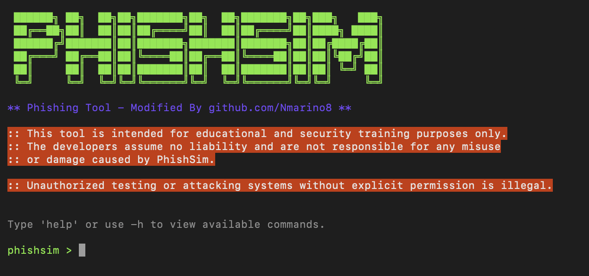
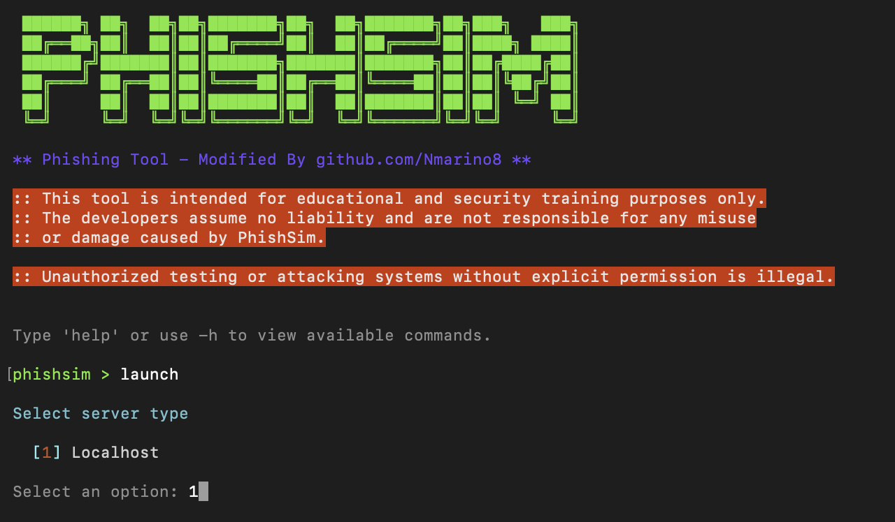
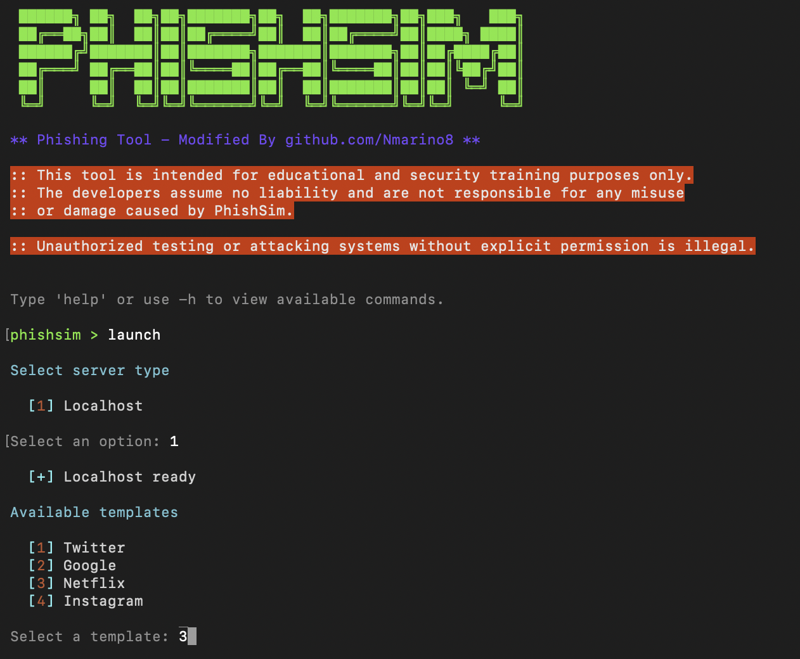
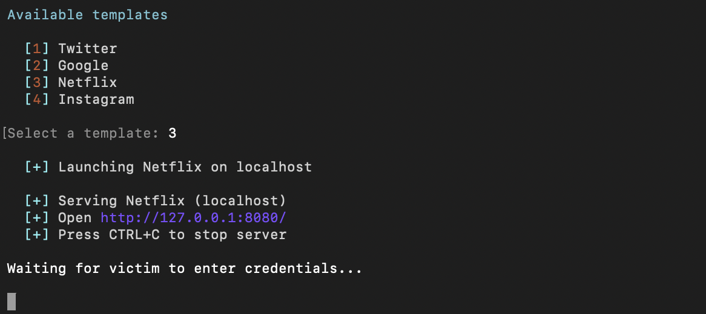
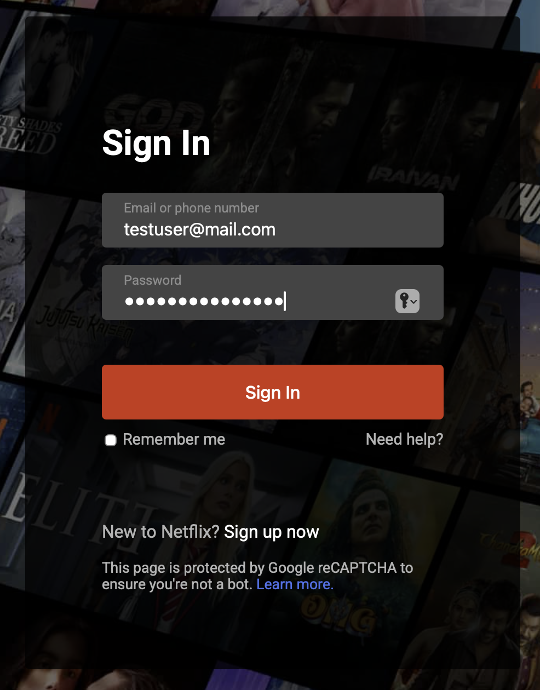
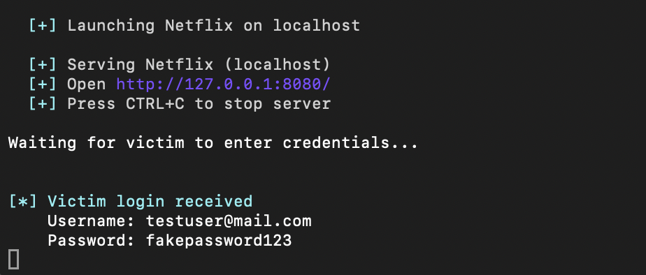

# PhishSim

**PhishSim** is an educational phishing-simulation tool inspired by BlackEye, designed to help users learn about phishing attacks, practice safe web habits, and understand how phishing techniques work in a controlled, safe environment. This tool is **strictly for educational purposes and security awareness training**.

---

## Table of Contents

- [Overview](#overview)
- [Versions](#versions)
- [Features](#features)
- [Templates](#templates)
- [Installation](#installation)
- [Usage](#usage)
- [How PhishSim Works](#how-phishsim-works)
- [Adding Custom Templates](#adding-custom-templates)
- [Project Structure](#project-structure)
- [Security Notice](#security-notice)
- [License](#license)
- [Contributing](#contributing)
- [Acknowledgements](#acknowledgements)

---

## Overview

PhishSim allows users to simulate phishing attacks in a safe, isolated environment.  
It launches a local server that hosts multiple fake websites (templates) which mimic popular services like Google, Instagram, Netflix, and Twitter. Users can interact with these sites to see how credentials would be captured in real attacks—but in reality, no sensitive data is exposed outside the simulation.  

The tool is ideal for:

- Cybersecurity students learning about phishing.  
- Security awareness workshops.  
- Demonstrating attack vectors in ethical hacking scenarios.

---

## Versions

#### [v1.0.0] – 21.12.2025
```Text
Added:
- Initial release of PhishSim.
- Built-in templates: Google, Instagram, Netflix, Twitter.
- Local server with terminal-based interface for educational phishing simulations.
- Support for adding custom templates.
```
---

## Features

- Hosts fake login pages for multiple templates.  
- Captures username input and password.  
- Displays captured input in the terminal for educational purposes.  
- Extensible architecture — add new templates without changing the server core.  
- Cross-platform support (Windows, macOS, Linux).  
- Simple, terminal-based interface for server control.  

---

## Templates

PhishSim includes several built-in templates by default, such as:

- **Google** — Mimics Google's login page  
- **Instagram** — Mimics Instagram's login page  
- **Netflix** — Mimics Netflix's login page  
- **Twitter** — Mimics Twitter's login page  

This list is **not exhaustive**. 
Additional templates will be added in future updates, 
and users can freely create and add their own custom templates.

> Templates can be added or removed by placing them in the `Templates` folder.

---

## Installation

1. Clone the repository and navigate into the project directory:
```text
git clone https://github.com/Nmarino8/PhishSim.git

```
```text
cd PhishSim/PhishSim

```

2. Ensure you have the .NET SDK installed:
```text
dotnet --version

```

3. Build the project:
```text
dotnet build

```
---

## Usage

**1.**	Run the project:
```text
dotnet run

```

Or, if you are in a parent folder:

```text
dotnet run --project PhishSim/PhishSim.csproj

```
2. Select the server type (for now only Localhost).
3. Select a template from the available list.
4. The local server will start and open your default browser with the chosen template.
5. Interact with the page (enter username and password).
6. Terminal output will show captured username and password.

---

## How PhishSim Works

> The following screenshots illustrate the complete workflow of **PhishSim**, from launching the application to demonstrating how credentials are captured in a **controlled, educational environment**.

---

#### 1. Program Startup
- PhishSim is launched from the terminal, displaying the main interface and available commands.



---

#### 2. Launch Command & Server Selection
- The `launch` command is executed, and the server type is selected (currently **Localhost**).



---

#### 3. Template Selection
- After selecting the server type, a phishing‑simulation template is chosen (example shown: **Netflix**, option 3).



---

#### 4. Template Opened in Browser
- The selected template automatically opens in the default web browser, displaying the simulated login page.


---

#### 5. Localhost Server Running
- The terminal confirms that the website is running on `localhost` and is waiting for user interaction.



---

#### 6. Entering Credentials
- Sample credentials are entered into the login form, and the **Sign In** button is pressed.



---

#### 7. Captured Credentials Displayed
- The terminal displays the captured username and password, demonstrating how phishing attacks operate in real scenarios — **strictly for educational and security awareness purposes**.



---
## Adding Custom Templates

To add a custom phishing‑simulation template, follow the steps below:

1. Create a new folder inside the `Templates/` directory.  
   The folder name will be used as the template name in PhishSim.

2. Inside the newly created folder, add the following files:

   - `index.html` — The main HTML page for your template  
   - `styles.css` — Optional CSS styling for the page  
   - `script.js` — **Required JavaScript file** (see below)  
   - `images/` — Optional folder for images and assets  

3. Your `index.html` **must** include a form with:
   - An element with `id="loginForm"`
   - A username input with `id="username"`
   - A password input with `id="password"`

4. Add the following **exact code** to your `script.js` file:

```javascript
const form = document.getElementById('loginForm');

form.addEventListener('submit', (e) => {
    e.preventDefault();

    const username = document.getElementById('username').value;
    const password = document.getElementById('password').value;

    fetch('/demo', {
        method: 'POST',
        headers: { 'Content-Type': 'application/json' },
        body: JSON.stringify({
            username: username,
            password: password
        })
    });

    form.reset();
});
```

5. Restart PhishSim.  
   The new template will automatically appear in the template selection menu.

> The server automatically detects and serves new templates without any changes to the core code.

---

## Project Structure

```bash
PhishSim/
├── CLI/                     # Command-line interface files
│   ├── CommandRouter.cs
│   ├── ConsoleUI.cs
│   └── Commands/
│       ├── LaunchCommand.cs
│       └── ListCommand.cs
├── Server/                  # Local server logic and template serving
│   ├── LocalServer.cs
│   ├── RequestFilter.cs
│   └── ServerConfig.cs
├── Templates/               # Fake website templates
│   ├── Google/
│   ├── Instagram/
│   ├── Netflix/
│   └── Twitter/
├── Utils/                   # Helper utilities (animations, colors, etc.)
│   └── TerminalAnimation.cs
├── PhishSim.csproj          # .NET project file
└── Program.cs               # Main entry point
```
---

## Security Notice

**Warning:** PhishSim is a simulation tool intended for **educational purposes only**.  

- No real credentials are captured or transmitted outside your local environment.  
- Always use PhishSim responsibly — **never deploy phishing templates on public networks** or use them maliciously.  
- This tool is strictly for **learning, training, and security awareness**.

---

## License

PhishSim is licensed under the **Creative Commons Attribution-NonCommercial 4.0 International (CC BY-NC 4.0)** license.

You are free to **share** (copy and redistribute) and **adapt** (modify) this project for any **non-commercial purpose**,  
as long as you give proper attribution to the original author: **Niko Marinović** ([https://github.com/Nmarino8](https://github.com/Nmarino8)).

You may **not use this project for commercial purposes**.

---

## Contributing

Contributions are welcome! You can contribute by:

- Adding new templates for educational purposes
- Improving the server or CLI features
- Fixing bugs or optimizing performance

### How to contribute

1. **Fork** the repository.
2. **Make changes** in your fork.
3. **Push** the changes to your fork.
4. **Open a Pull Request** to merge your changes into this repository.
5. Use **Issues** to discuss bugs, suggest features, or ask questions.

---

## Acknowledgements

- Inspired by **BlackEye** as a foundation for educational phishing simulations.  
- Thanks to the **cybersecurity community** for their guidance, insights, and best practices.  

---

**Disclaimer: This project is intended for educational use only. The author is not responsible for misuse. Always use ethically.**
